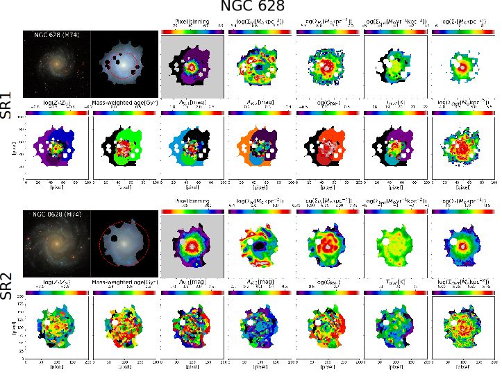
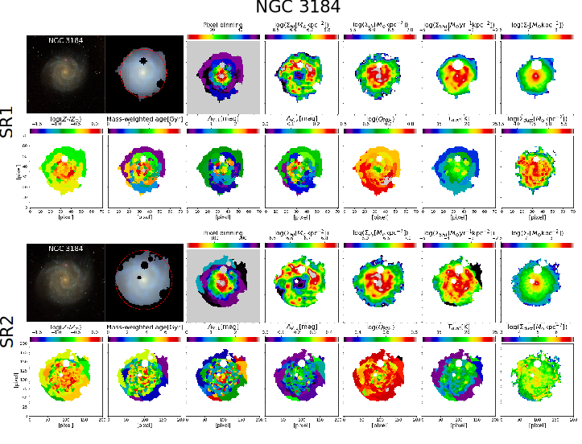
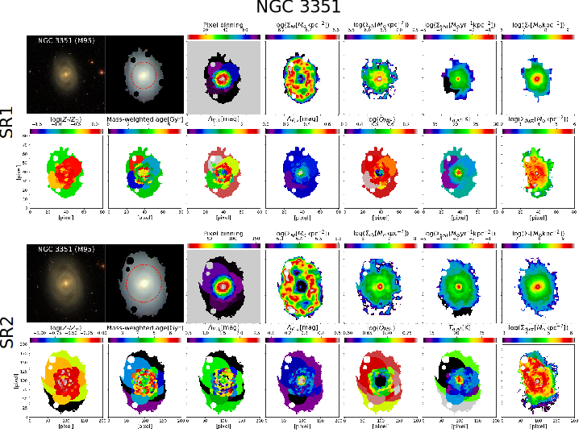
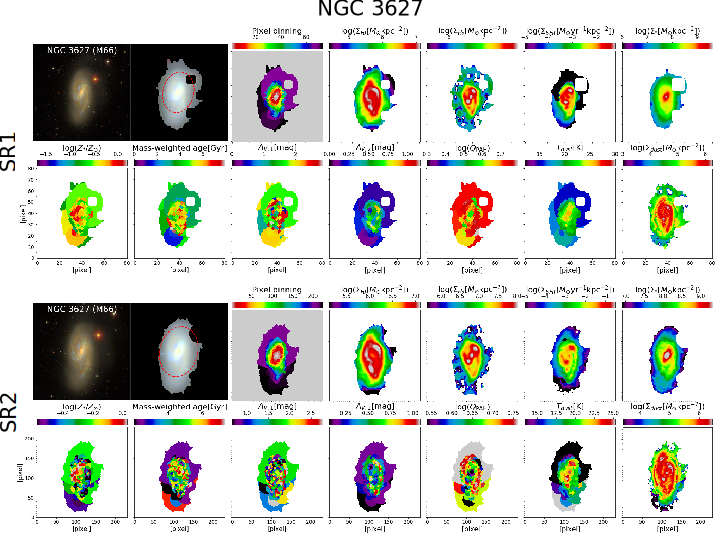
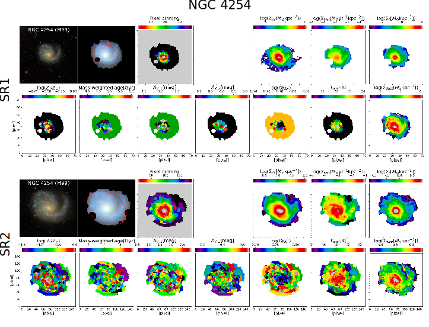
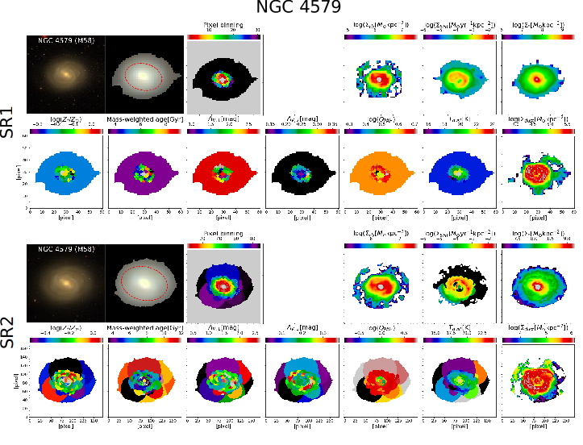
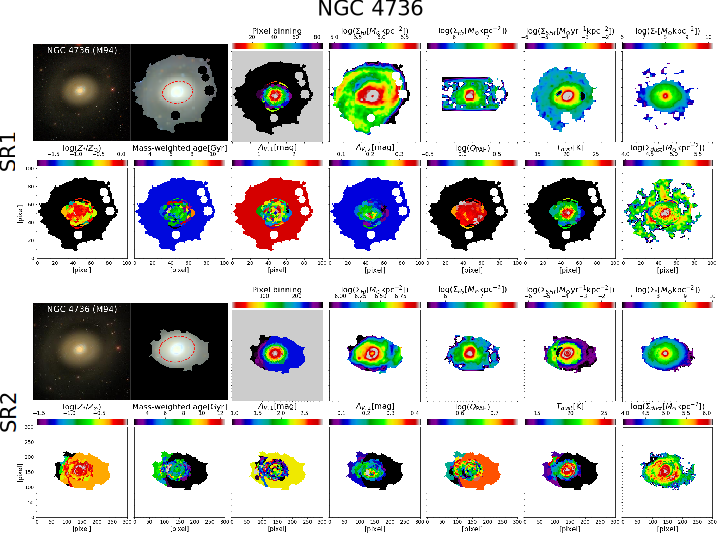
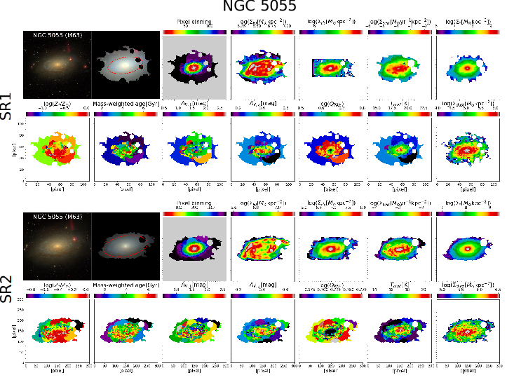
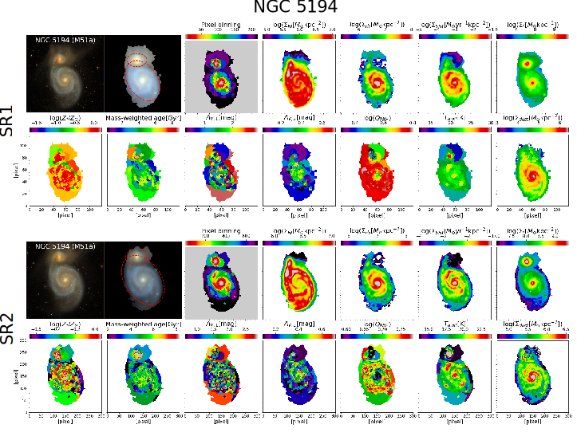
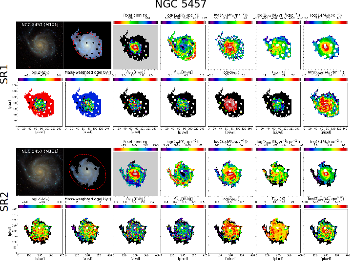

## Maps of spatially resolved properties (of stars, dust, and gas) of nearby spiral galaxies

This repository provides complementary figures to Fig. 4 (for all 10 galaxies; please see below) and a high resolution version of Fig. 8 (file name: Figure_8.eps or Figure_8.svg) in a paper [Abdurro'uf et al. (2021)](https://ui.adsabs.harvard.edu/abs/2021arXiv211003158A/abstract) ("Dissecting Nearby Galaxies with piXedfit: I. Spatially Resolved Properties of Stars, Dust, and Gas as Revealed by Panchromatic SED Fitting"). **Data product in the form of maps of the spatially resolved properties (in FITS file) will be made publicly available upon the publication of the second paper in the series**. Any inquiry related to this can be sent to abdurrouf@asiaa.sinica.edu.tw.

